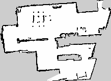

# Map post-processing

Clean images with occupancy maps (PGM/PNG) by removing isolated obstacles — such as an operator's legs captured during teleoperation — while preserving thin walls and overall map structure.

This is compatible with [nav2](https://github.com/ros-navigation/navigation2) and [slam_toolbox](https://github.com/SteveMacenski/slam_toolbox) maps. For a comple guide on how to generate a map to clean it up refer to [this guide](#generate-a-clean-map)

> Note: The code in this repo was mostly generated with AI and meant for a personal project. The main purpose is to share it in case someone else can use it for their own benefit. It was not thoroughly tested.

## Comparison

After setting up uv, run:

```
uv run python map_post_processing.py examples/example_map.png -o examples/cleaned_map.png --min-area 1 --preview
```

Map before post-processing:


Map after post-processing:



## Setup

Requires [uv](https://docs.astral.sh/uv/). All dependencies are managed through `pyproject.toml`.

```bash
uv sync
```

## Usage

```bash
uv run python map_post_processing.py <input> [options]
```

### Arguments

| Argument | Description |
|----------|-------------|
| `input`  | Path to the input map image (PNG or PGM). |

### Options

| Option | Type | Default | Description |
|--------|------|---------|-------------|
| `-o`, `--output` | string | `<input>_clean.<ext>` | Output file path for the cleaned map. |
| `--min-area` | int | `30` | Minimum contour area (in pixels) to keep. Obstacles smaller than this are removed. |
| `--free-thresh` | int | `230` | Pixel value threshold above which a cell is considered free space. |
| `--occupied-thresh` | int | `50` | Pixel value threshold below which a cell is considered occupied. |
| `--preview` | flag | — | Generate a side-by-side comparison image (`<input>_comparison.png`) showing the original, cleaned, and diff views. |

### Examples

Basic cleanup with default settings:

```bash
uv run python map_post_processing.py map.png
```

Custom output path and minimum area:

```bash
uv run python map_post_processing.py map.png -o map_cleaned.png --min-area 50
```

Remove even single-pixel noise and generate a comparison image:

```bash
uv run python map_post_processing.py examples/kimchi_map.png -o cleaned_map.png --min-area 1 --preview
```

## How it works

The cleaning pipeline:

1. **Binarization** — Separates the grayscale map into obstacle, free, and unknown zones using configurable thresholds.
2. **Area filtering** — Finds connected obstacle contours and removes any with an area below `--min-area` pixels.
3. **Reconstruction** — Rebuilds the map using  the following occupancy values : free = 254, occupied = 0, unknown = 205.


## Generate a clean map 

Guide to generate a clean map with slam_toolbox and the map post-processing.

1. Generate a map: Follow nav2 guide to generate a map using slam_toolbox: [Navigating while Mapping (SLAM)](https://docs.nav2.org/tutorials/docs/navigation2_with_slam.html)

2. Save the generated map: 

```
ros2 run nav2_map_server map_saver_cli -f ~/map
```

This will generate 2 files:
- map.yaml: Image with information of the map such as the path of the map file (the png) and where in the png is the (0,0) point.
- map.png: image with the map

3. Run post-processing:


```bash
uv run python map_post_processing.py <path to map.png> -o cleaned_map.png --min-area 1 --preview
```

4. SUPER IMPORTANT: remember to update the name of the png file inside map.yaml
